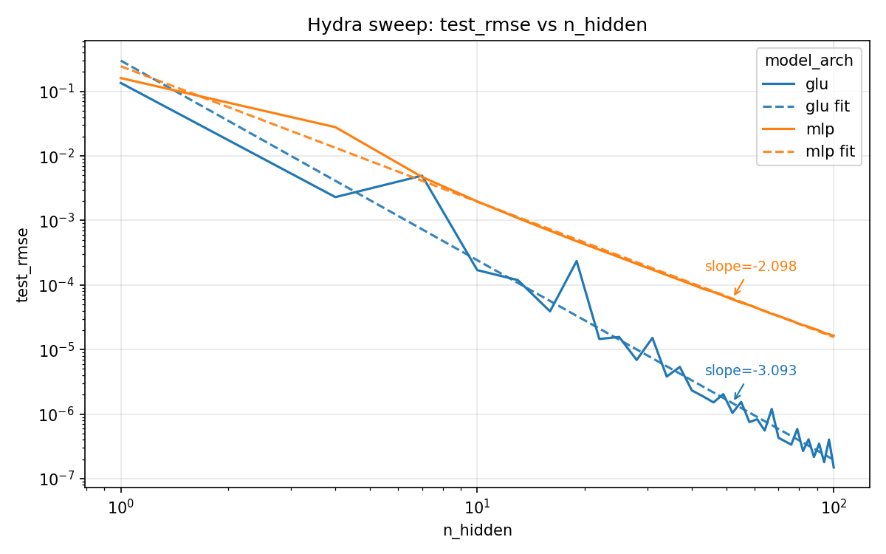

# Asymptotic Scaling Rates

This repository contains experiments demonstrating that model architecture choices change the slopes of L(P) scaling rates, meaning that asymptotically faster scaling is possible. GLUs have a quadratic term, which lets them exactly represent piecewise quadratic functions. 


## Speedrun:

The minimal experiment that empirical validates the L(P) scaling slopes takes 10 seconds on CPU:
```bash
python3 -m divine_scaling.experiment -m model_arch=mlp,glu "n_hidden=range(1,103,3)" apply_maso_init=True optimizer=newton_only_splines
python3 -m divine_scaling.plot_multirun --show
```
This will pop up the following graph:



## Running:

The experiment is managed with hydra configs.

- Running a sweep: `python3 -m divine_scaling.experiment -m model_arch=mlp,glu "n_hidden=range(1,30)"`
- There are some unit tests: `python3 -m unittest discover -s divine_scaling -p "*_test.py"`

## Citing

To reference this work, please cite:
```
{paper}
```